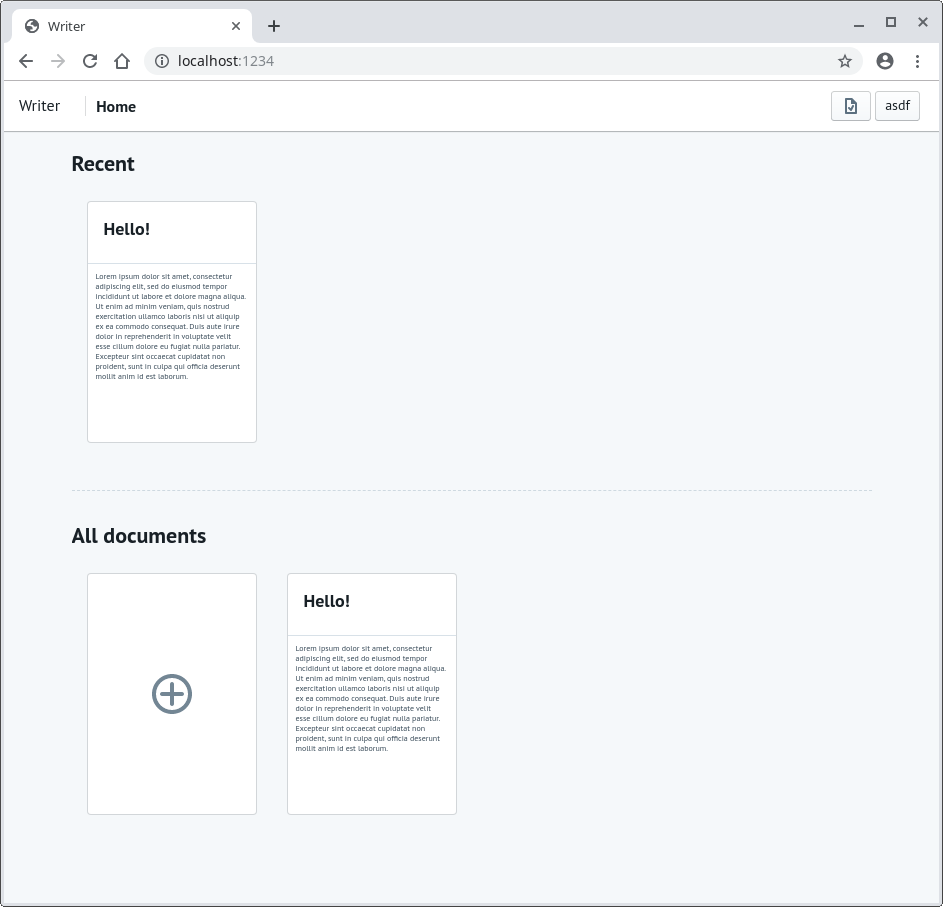

# writer
A simple web/markdown-based note taking app
You can take a loot at the hosted version on heroku: https://ustk-writer.herokuapp.com

This is a notebook app written in typescript using koa for the backend and react+redux for the frontend.

## Getting started

First, install all of the dependencies with `npm i` and `cd frontend && npm i`

You also need to create a ormconfig.json and ormconfig.test.json (only if you want to run the tests). You can use ormconfig.example.json as an example (you only need to change the database connection settings)

Then start with `npm run dev` and visit http://localhost:1234

Parcel will be listening at http://localhost:1234, and koa at http://localhost:3000
